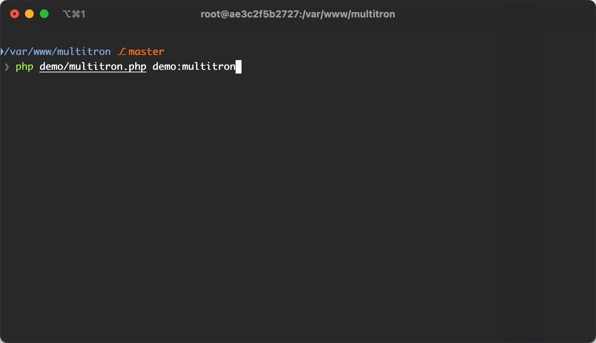

# Multitron: High-Performance PHP Task Orchestrator

[](https://packagist.org/packages/riki137/multitron)
[](https://packagist.org/packages/riki137/multitron)
[](LICENSE)
[](https://github.com/riki137/multitron/actions?query=workflow%3Aci+branch%3Amaster)
[](https://codecov.io/gh/riki137/multitron)
[](https://github.com/phpstan/phpstan)

**Multitron** is a powerful, high-performance **PHP task orchestrator** designed to simplify parallel processing, concurrency, and automation in PHP applications. Quickly execute complex tasks asynchronously, maximizing the efficiency and scalability of your workflows.

**Ideal for Symfony Console apps, CI/CD pipelines, batch processing, and heavy PHP workloads.**

---



---

## Why Choose Multitron?

* 🔄 **Efficient Task Dependency Management**: Clearly define task dependencies with intuitive declarative syntax.
* ⚡ **Optimized Parallel Execution**: Automatic CPU core detection for peak performance and resource utilization.
* 🧩 **Partitioned Workloads**: Easily split large tasks across multiple worker processes.
* 📊 **Real-Time Progress & Transparency**: Continuous console logging and progress tracking.
* 🗄️ **Centralized Cache for Tasks**: Inter-process data sharing and communication made simple.
* 🔌 **Symfony Console Ready**: Effortlessly integrate Multitron into your existing Symfony-based applications.
* 📄 **Open Source & MIT Licensed**: Completely free to use, adapt, and distribute.

## Installation

* [Symfony Integration](src/Bridge/Symfony/README.md)
* [Laravel Integration](src/Bridge/Laravel/README.md)
* [Native PHP Integration](src/Bridge/Native/README.md)
* [Nette Integration](src/Bridge/Nette/README.md)

## Usage

Tasks implement the `Multitron\Execution\Task` interface. Here's a minimal example task:

```php
use Multitron\Comms\TaskCommunicator;
use Multitron\Execution\Task;

final class HelloTask implements Task
{
    public function execute(TaskCommunicator $comm): void
    {
        $comm->log('Hello from a worker');
    }
}
```


You can register tasks in a command that extends `Multitron\Console\TaskCommand`:

```php
use Multitron\Console\TaskCommand;
use Multitron\Tree\TaskNode;
use Multitron\Tree\TaskTreeBuilder;
use Symfony\Component\Console\Attribute\AsCommand;

#[AsCommand(name: 'app:tasks')]
final class MyCommand extends TaskCommand
{
    /**
     * @return TaskNode[]
     */
    public function getNodes(TaskTreeBuilder $b): array
    {
        return [
            $cache = $b->group('cache-clear', [
                $b->service(ClearCacheTask::class),
                $b->service(ClearLogsTask::class),
            ]),
            $b->service(AfterCacheClearTask::class, dependencies: [$cache]),
            $first = $b->service(MyFirstTask::class),
            $second = $b->service(MySecondTask::class, dependencies: [$first]),
            $anotherSecond = $b->service(MyAnotherSecondTask::class, dependencies: [$first]),
            $b->partitioned(MyPartitionedTask::class, 4, dependencies: [$second, $cache]),
        ];
    }
}
```

Register the command in your Symfony Console application and run it. Multitron will execute the tasks respecting dependencies and concurrency.

You can control how many tasks run at once via the `-c`/`--concurrency` option:

```bash
php bin/console app:tasks -c 8
```

The library will spawn up to eight worker processes and keep them busy until all tasks finish.

To limit which tasks run, pass a pattern as the first argument. Wildcards work the same as in `fnmatch()` and you may use `%` in place of `*` for convenience:

```bash
php bin/console app:tasks cache-* # run only tasks whose ID or tag matches "cache-*"
```

You can combine multiple patterns by separating them with commas. The filter applies
to both task IDs and tags and is an OR pattern.

```bash
php bin/console app:tasks "db-%,cache-%,final-%"
```

You can also tune how often progress updates are rendered using the `-u`/`--update-interval` option (in seconds):

```bash
php bin/console app:tasks -u 0.5
```

You may also constrain memory usage with the `-m`/`--memory-limit` option:

```bash
php bin/console app:tasks -m 512M
```

When you want proactive alerts about constrained environments, pass the `--low-memory-warn` option. The value represents the
available-memory threshold in megabytes (defaults to `1024`). Multitron prints a warning when free memory drops below the
limit, helping you catch memory pressure before workers crash. Set the option to `0` to disable the warning entirely:

```bash
php bin/console app:tasks --low-memory-warn=512
```

You can disable colors with `--no-colors` and switch off interactive table rendering using `--interactive=no`. The default `--interactive=detect` automatically falls back to plain output when run in CI.

### Central Cache

Within a task you receive a `TaskCommunicator` instance that provides simple methods to read and write data shared between tasks:

```php
use Multitron\Comms\TaskCommunicator;

final class MyTask implements Task
{
    public function execute(TaskCommunicator $comm): void
    {
        $comm->cache->write(['foo' => ['bar' => 'baz']]);
        $baz = $comm->cache->read(['foo' => ['bar']])->await()['foo']['bar']; // returns "baz"
        
        // Read existing values first, then update
        $existing = $comm->cache->read(['stats' => ['hits']])->await();
        $hits = $existing['stats']['hits'] ?? 0;
        $comm->cache->write(['stats' => ['hits' => $hits + 1]]);
    }
}
```

### Reporting Progress

Tasks can update progress counters that Multitron displays while running. Use
the `ProgressClient` provided by the communicator:

```php
final class DownloadTask implements Task
{
    public function execute(TaskCommunicator $comm): void
    {
        $comm->progress->setTotal(100);
        for ($i = 0; $i < 100; $i++) {
            // ... work
            $comm->progress->addDone();
        }
    }
}
```

You may also call `addOccurrence()` or `addWarning()` to report additional
metrics or warnings.

### Partitioned Tasks

When a workload can be split into chunks, partitioned tasks run those chunks in parallel. Define a task extending `PartitionedTask` and specify the number of partitions in the tree:

```php
use Multitron\Tree\Partition\PartitionedTask;

final class BuildReportTask extends PartitionedTask // or implements PartitionedTaskInterface, use PartitionedTaskTrait
{
    public function execute(TaskCommunicator $comm): void
    {
        $comm->log("processing part {$this->partitionIndex} of {$this->partitionCount}");
    }
}

$builder->partitioned(BuildReportTask::class, 4);
```

### Accessing CLI Options

Options passed on the command line are forwarded to each task. Retrieve them via
`TaskCommunicator`:

```php
final class ProcessUsersTask implements Task
{
    public function execute(TaskCommunicator $comm): void
    {
        $limit = (int)($comm->getOption('limit') ?? 0);
        // ... process with the given $limit
    }
}
```

Call `getOptions()` to receive the entire array of options if needed.


### Custom Progress Output

Multitron renders progress using a `ProgressOutputFactory`. Replace the default table display or combine outputs with `ChainProgressOutputFactory`:

```php
use Multitron\Orchestrator\Output\ChainProgressOutputFactory;
use Multitron\Orchestrator\Output\TableOutputFactory;
use Multitron\Bridge\Native\MultitronFactory;

$factory = new MultitronFactory();

$outputFactory = new ChainProgressOutputFactory(
    $factory->getProgressOutputFactory(),
    new JsonOutputFactory(), // your own class for custom output
);

$factory->setProgressOutputFactory($outputFactory);
```

Implement the factory to send progress anywhere you like.

---

## Contribute to Multitron!

Your feedback, issues, and contributions are highly encouraged. Open a GitHub issue or start a pull request to help improve PHP concurrency and task management:

* [Create an Issue](https://github.com/riki137/multitron/issues)
* [Submit a Pull Request](https://github.com/riki137/multitron/pulls)

---

## License

Multitron is MIT licensed. See the [LICENSE](LICENSE) file for full details.

---

**SEO Keywords:** PHP Task Orchestrator, Parallel Processing PHP, Symfony CLI Automation, Asynchronous PHP Tasks, Multitron PHP, PHP Concurrency, PHP Task Manager, Open-source PHP Library
